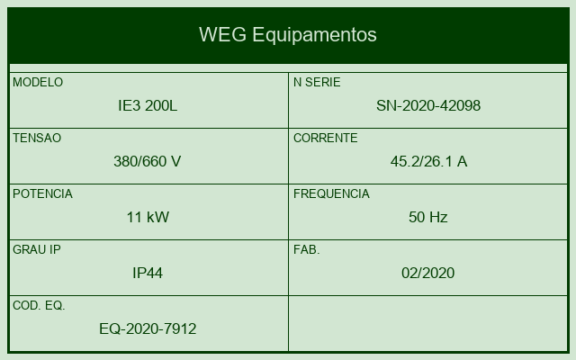
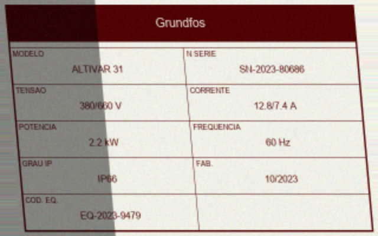
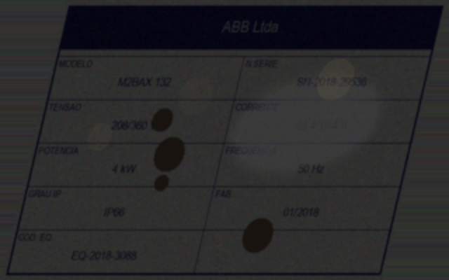

# Evidências de Execução: Sprint 3

Amostras reais das 30 imagens de teste (1 por nível de dificuldade) e a saída de cada uma das
3 abordagens sobre elas, extraídas diretamente de `results/raw/*.json` e comparadas com
`data/ground_truth.csv`. Dados completos das 30 imagens em `results/metrics/results_detalhado.csv`
(300 avaliações por abordagem) e `results/metrics/error_analysis.csv` (só os erros).

## Gráficos comparativos (30 imagens)

| Gráfico | Arquivo |
|---|---|
| Acurácia geral por abordagem | `../results/visualizations/accuracy_comparison.png` |
| Acurácia por nível de dificuldade | `../results/visualizations/accuracy_by_difficulty.png` |
| Acurácia por campo extraído | `../results/visualizations/accuracy_by_field.png` |
| Tempo médio de processamento | `../results/visualizations/processing_time.png` |

## Exemplo 1: `easy_00` (fácil)



| Campo | Gabarito | Tesseract | EasyOCR | Multimodal (visão) |
|---|---|---|---|---|
| fabricante | WEG Equipamentos | WEG Equipamentos ✅ | *(vazio)* ❌ | WEG Equipamentos ✅ |
| modelo | IE3 200L | IE3 200L ✅ | IE3 200L ✅ | IE3 200L ✅ |
| num_serie | SN-2020-42098 | SN-2020-42098 ✅ | SN-2020-42098 ✅ | SN-2020-42098 ✅ |
| tensao | 380/660 V | 380/660 V ✅ | 380/660 V ✅ | 380/660 V ✅ |
| corrente | 45.2/26.1 A | 45.2/26.1 A ✅ | *(vazio)* ❌ | 45.2/26.1 A ✅ |
| potencia | 11 kW | 11 kW ✅ | 11 kW ✅ | 11 kW ✅ |
| frequencia | 50 Hz | 50 Hz ✅ | 50 Hz ✅ | 50 Hz ✅ |
| grau_ip | IP44 | IP44 ✅ | *(vazio)* ❌ | IP44 ✅ |
| data_fab | 02/2020 | 02/2020 ✅ | 02/2020 ✅ | 02/2020 ✅ |
| cod_equipamento | EQ-2020-7912 | EQ-2020-7912 ✅ | EQ-2020-7912 ✅ | EQ-2020-7912 ✅ |

Em condição fácil, Tesseract e a leitura multimodal acertam os 10/10 campos; o EasyOCR já perde
3 campos mesmo aqui (fabricante, corrente, grau_ip), primeiro sinal de que ele generaliza pior
para este layout de placa do que na Sprint 2.

## Exemplo 2: `medium_00` (médio, inclinação de câmera + iluminação variável)



| Campo | Gabarito | Tesseract | EasyOCR | Multimodal (visão) |
|---|---|---|---|---|
| fabricante | Grundfos | *(vazio)* ❌ | Grundfos ✅ | Grundfos ✅ |
| modelo | ALTIVAR 31 | *(vazio)* ❌ | *(vazio)* ❌ | ALTIVAR 31 ✅ |
| num_serie | SN-2023-80686 | SN-2023-80686 ✅ | *(vazio)* ❌ | SN-2023-80686 ✅ |
| tensao | 380/660 V | *(vazio)* ❌ | *(vazio)* ❌ | 380/660 V ✅ |
| corrente | 12.8/7.4 A | *(vazio)* ❌ | *(vazio)* ❌ | 12.8/7.4 A ✅ |
| potencia | 2.2 kW | *(vazio)* ❌ | *(vazio)* ❌ | 2.2 kW ✅ |
| frequencia | 60 Hz | 60 Hz ✅ | *(vazio)* ❌ | 60 Hz ✅ |
| grau_ip | IP66 | *(vazio)* ❌ | *(vazio)* ❌ | IP66 ✅ |
| data_fab | 10/2023 | 10/2023 ✅ | *(vazio)* ❌ | 10/2023 ✅ |
| cod_equipamento | EQ-2023-9479 | *(vazio)* ❌ | *(vazio)* ❌ | EQ-2023-9479 ✅ |

A leitura multimodal acerta os 10/10 campos mesmo com inclinação de câmera; os dois OCRs
clássicos praticamente colapsam (2/10 e 0/10), o que confirma que a perspectiva de captura é
o fator que mais expõe a fragilidade da dupla OCR+regex.

## Exemplo 3: `hard_00` (difícil, reflexo/baixa iluminação + inclinação forte + baixa resolução)



| Campo | Gabarito | Tesseract | EasyOCR | Multimodal (visão) |
|---|---|---|---|---|
| fabricante | ABB Ltda | *(vazio)* ❌ | *(vazio)* ❌ | ABB Ltda ✅ |
| modelo | M2BAX 132 | *(vazio)* ❌ | *(vazio)* ❌ | M2BAX 132 ✅ |
| num_serie | SN-2018-29536 | *(vazio)* ❌ | *(vazio)* ❌ | *(vazio)* ❌ |
| tensao | 208/360 V | *(vazio)* ❌ | *(vazio)* ❌ | 208/360 V ✅ |
| corrente | 28.4/16.4 A | *(vazio)* ❌ | *(vazio)* ❌ | *(vazio)* ❌ |
| potencia | 4 kW | *(vazio)* ❌ | *(vazio)* ❌ | 4 kW ✅ |
| frequencia | 50 Hz | *(vazio)* ❌ | *(vazio)* ❌ | 50 Hz ✅ |
| grau_ip | IP66 | *(vazio)* ❌ | *(vazio)* ❌ | IP66 ✅ |
| data_fab | 01/2018 | *(vazio)* ❌ | *(vazio)* ❌ | 01/2018 ✅ |
| cod_equipamento | EQ-2018-3088 | *(vazio)* ❌ | *(vazio)* ❌ | EQ-2018-3088 ✅ |

Em condição difícil, os dois OCRs clássicos zeram (0/10) e a leitura multimodal ainda acerta
8/10: só falha nos dois campos mais degradados da imagem (`num_serie`, `corrente`), e o faz
devolvendo campo vazio em vez de um valor inventado (comportamento discutido na seção 6.1 do
relatório técnico).

## Como estas amostras foram extraídas

```bash
python -c "
import json, pandas as pd
gt = pd.read_csv('data/ground_truth.csv').set_index('image_id')
raw = {m: {r['image_id']: r for r in json.load(open(f'results/raw/{m}.json', encoding='utf-8'))}
       for m in ['tesseract', 'easyocr', 'claude_vision']}
# gt.loc['easy_00'], raw['tesseract']['easy_00']['campos'], etc.
"
```
