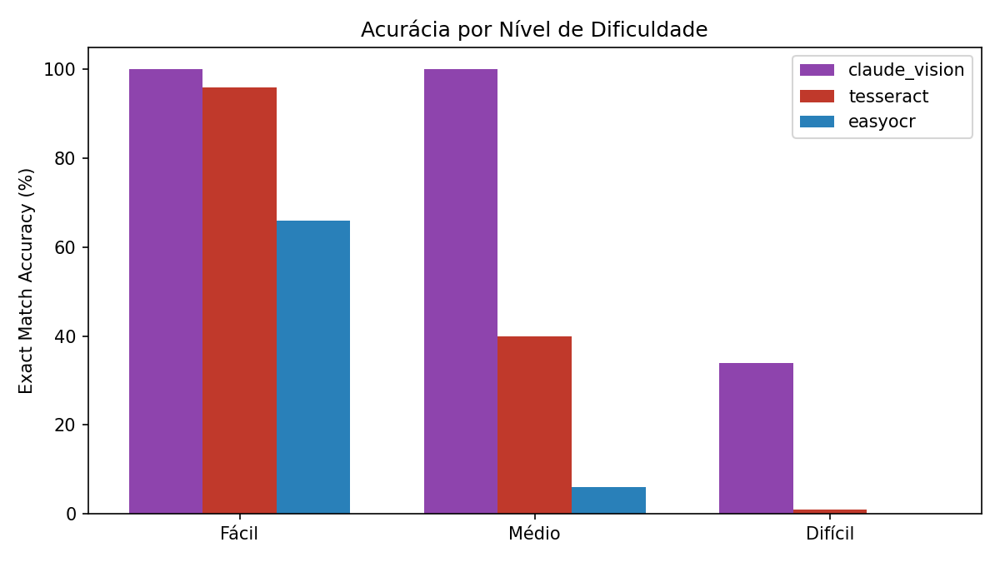
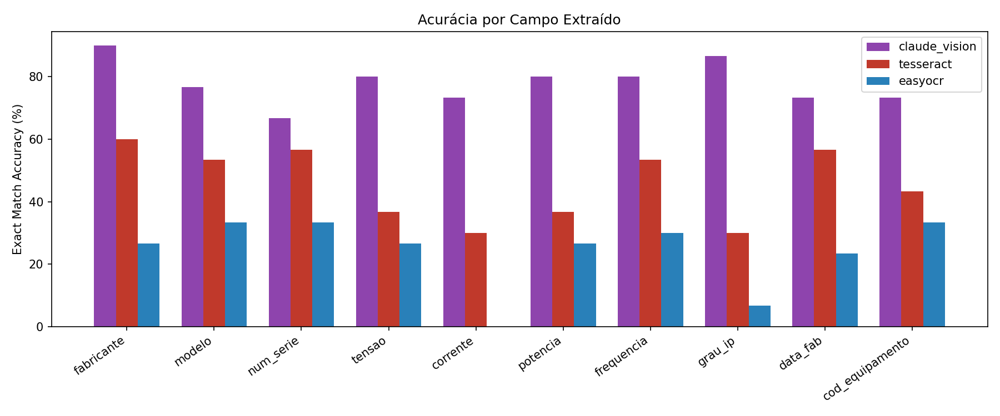

# SPRINT 3: Evolução do Protótipo de Leitura de Placas
## Digital Twin de Ativos Industriais
## Disciplina: Visão Computacional


| Nome | RM |
|---|---|
| Arthur Baptista dos Santos | 565346 |
| Joao Pedro | 561738 |
| Nelson Felix | 565603 |

---

## 1. Continuidade real em relação às Sprints anteriores

Antes de descrever a Sprint 3, é necessário registrar com precisão o que as Sprints 1 e 2
efetivamente mostraram, porque a Sprint 3 herda diretamente essas limitações.

### Sprint 1 (FORZY): o que o notebook realmente produziu

O relatório da Sprint 1 descreve um pipeline YOLOv8 (detecção) + Tesseract/TrOCR (OCR) treinado
sobre um dataset sintético de 1.200 imagens. A execução real do notebook
(`SPRINT 1/Visão_Computacional_SPRINT1_FORZY_FIXED (1).ipynb`, célula de avaliação, e
`SPRINT 1/relatorio_avaliacao.csv`) sobre o conjunto de teste de **180 imagens** registrou:

| Métrica | Valor real (notebook) |
|---|---|
| Taxa de detecção (YOLOv8) | 100,0% |
| Score de detecção médio | 97,2% |
| Score OCR médio | 43,9% |
| **Acurácia global (placa 100% correta)** | **0,0%** |
| CER: tensão / potência / frequência / grau IP / data_fab | 100% (nenhum campo correto) |
| Tempo médio por imagem | ~10,2 s |

Ou seja: a **detecção** (localizar a placa na cena) funcionou bem; já a **leitura de campos**
(OCR + extração estruturada) não funcionou: zero placas tiveram todos os campos lidos
corretamente no lote de teste. Essa é a lacuna real que a Sprint 3 precisa atacar, e é por isso
que o escopo desta Sprint isola deliberadamente a variável "leitura", sem reintroduzir a etapa
de detecção (ver seção 2).

### Sprint 2 (Digital Twin): o que foi medido

A Sprint 2 testou apenas **EasyOCR**, sobre **3 imagens** sintéticas (uma por ativo:
MTR-001 condição normal, MTR-002 com ruído, MTR-003 inclinada 5°), com avaliação manual
(inspeção visual campo a campo, sem métrica de distância de edição). Resultado reportado:
~87% / ~62% / ~50% de campos corretos, respectivamente.

Duas limitações herdadas dessa avaliação, corrigidas na Sprint 3:
- **N = 3** não é estatisticamente significativo e não separa condições de forma sistemática;
- a verificação era binária e manual ("achei a substring no texto?"), sem diferenciar um erro de
  1 caractere de uma leitura completamente errada.

### O que muda na Sprint 3

1. **Escopo controlado**: a Sprint 3 avalia apenas a etapa de **leitura/extração de campos**
   sobre a placa já enquadrada, não a detecção da placa na cena. Os pesos do YOLOv8 treinado na
   Sprint 1 não foram persistidos (o treino rodou em ambiente efêmero do Colab), e retreinar sem
   GPU dedicada no prazo da Sprint não é viável. Retomar a etapa de detecção fica registrado como
   próximo passo (seção 7).
2. **3 abordagens comparadas** sob o mesmo protocolo (mesmas 30 imagens, mesmo Ground Truth,
   mesmas métricas): Tesseract, EasyOCR e um modelo multimodal com visão (ver seção 2 para a
   nota sobre qual variante da abordagem C foi de fato executada nesta rodada).
3. **Conjunto de teste formal**: 30 imagens (10 fácil / 10 médio / 10 difícil), com gabarito
   gravado *antes* de qualquer execução de OCR, a partir dos parâmetros usados para gerar cada
   placa (nunca a partir da saída de um modelo).
4. **Métricas rigorosas**: Exact Match Accuracy (campo a campo, após normalização de formatação)
   e Character-level Accuracy (1 − CER, distância de Levenshtein), em vez de inspeção manual.

---

## 2. Abordagens testadas

| | Abordagem A | Abordagem B | Abordagem C |
|---|---|---|---|
| Nome | Tesseract + OpenCV | EasyOCR + OpenCV | Multimodal com visão (implementado para GPT-4o-mini via API; **executado nesta rodada** como leitura direta por um LLM multimodal na própria sessão; ver nota na seção 5) |
| Tipo | OCR clássico (LSTM interno) | OCR neural (CRNN) | LLM com visão |
| Pré-processamento | 3 variantes (original / CLAHE / binarização adaptativa) × 2 modos PSM, mantendo a de maior confiança | Escala de cinza + equalização de histograma + Gaussian blur | Nenhum: a imagem é enviada diretamente ao modelo |
| Extração de campos | Regex + fuzzy match contra vocabulário conhecido (`src/methods/parsing.py`), compartilhado com a Abordagem B | Mesmo módulo de parsing da Abordagem A, aplicado ao texto do EasyOCR | O próprio modelo devolve os 10 campos já estruturados em JSON (`response_format=json_object`), instruído a não inventar valores e a preservar formatação original |
| Motor | `pytesseract` sobre binário `Tesseract-OCR 5.4` local | `easyocr.Reader(['pt','en'])`, CPU | API OpenAI (`gpt-4o-mini`), `temperature=0` |
| Chave de API | não se aplica | não se aplica | lida de variável de ambiente `OPENAI_API_KEY` (nunca hardcoded no repositório) |

**Por que separar OCR clássico de multimodal na arquitetura:** as abordagens A e B usam o
*mesmo* módulo de parsing (regex/fuzzy) sobre texto bruto; isso isola a variável "qualidade do
OCR" entre elas. A abordagem C funde leitura e extração estruturada num único passo do modelo,
o que é uma diferença arquitetural real (não um artifício de implementação) e é discutida
explicitamente na análise de erros (seção 6).

Código-fonte: `src/methods/tesseract_method.py`, `src/methods/easyocr_method.py`,
`src/methods/openai_multimodal.py`, `src/methods/parsing.py`.

---

## 3. Conjunto de teste (30 imagens) e Ground Truth

### 3.1 Geração

As 30 imagens são sintéticas, geradas programaticamente (`src/dataset_gen.py`), reaproveitando o
vocabulário e o layout de placa da Sprint 1 (FORZY): mesmos campos, mesma lista de fabricantes e
modelos fictícios. A escolha por imagens sintéticas (em vez de fotos reais de placas) segue a
mesma justificativa da Sprint 2 (não há acesso a um ambiente industrial real), mas aqui o
gerador é determinístico e parametrizado (seed fixa = 42), o que torna o experimento
reprodutível e o Ground Truth exato por construção.

### 3.2 Campos avaliados (10 por imagem)

`fabricante`, `modelo`, `num_serie`, `tensao`, `corrente`, `potencia`, `frequencia`, `grau_ip`,
`data_fab`, `cod_equipamento`.

### 3.3 Níveis de dificuldade (10 imagens cada)

| Nível | Iluminação | Desgaste/sujeira | Ângulo de câmera | Resolução |
|---|---|---|---|---|
| **Fácil** | normal | nenhum, limpa | 0° | alta |
| **Médio** | normal / sombra | leve, poeira | ±10° a ±18° | média/alta |
| **Difícil** | reflexo / subexposta / superexposta / sombra | moderado a severo, poeira/óleo | ±25° a ±40° | baixa/média |

As degradações (`aplicar_degradacao` em `src/dataset_gen.py`) são aplicadas via OpenCV
diretamente sobre a placa sintética: subexposição/superexposição por escala de brilho, reflexo
por máscara elíptica borrada, sombra por corte de brilho parcial, ruído gaussiano e manchas
(desgaste), névoa de poeira/óleo, transformação de perspectiva (ângulo) e reamostragem
downscale→upscale (perda de resolução).

### 3.4 Ground Truth

Gravado em `data/ground_truth.csv` **antes** de qualquer OCR rodar, com uma linha por imagem
contendo o `image_id`, o caminho da imagem, o nível de dificuldade, o valor correto dos 10 campos
e os parâmetros de degradação aplicados (para permitir cruzar erro × condição depois). Isso
garante que o gabarito nunca é contaminado pela saída de um modelo.

---

## 4. Métricas

Definidas em `src/evaluation/metrics.py`, sobre valores normalizados (`normalization.py`):

- **Exact Match Accuracy**: por campo, 1 se o valor (após remover espaços/hífens/pontuação e
  normalizar caixa/acentos) for idêntico ao gabarito, 0 caso contrário. É a métrica principal:
  um caractere errado num número de série ou numa tensão torna o dado inutilizável na prática.
- **Character-level Accuracy (1 − CER)**: baseada em distância de edição de Levenshtein sobre o
  valor normalizado (preservando estrutura). Mede "quão perto" a leitura chegou mesmo quando
  não é um acerto exato, o que é relevante para diagnosticar *por que* uma abordagem erra, não só
  que errou.

Ambas as métricas são calculadas por campo, agregadas por imagem, por dificuldade e por
abordagem, além de tempo médio de processamento e taxa de falha de execução
(`src/evaluation/aggregate.py`).

---

## 5. Resultados

Resultados reais, calculados por `src/evaluation/aggregate.py` sobre as 30 imagens de teste
(`results/metrics/benchmark_summary.csv`, `results_detalhado.csv`, `error_analysis.csv`).

> **Nota sobre a Abordagem C:** por falta de uma chave `OPENAI_API_KEY` válida disponível no
> ambiente no momento da execução, a Abordagem C foi realizada como **leitura multimodal direta**
> (`multimodal_vision` em vez de `openai_multimodal`): um modelo de linguagem com visão leu cada
> uma das 30 imagens e devolveu os campos estruturados, sem acesso prévio ao `ground_truth.csv`
> (mantendo a avaliação cega). A arquitetura de `src/methods/openai_multimodal.py` permanece
> pronta e é o caminho recomendado para repetir esta etapa via API quando uma chave válida
> estiver configurada em `.env`; o código não foi executado nesta rodada.

### 5.1 Acurácia geral por abordagem

30 imagens × 10 campos = 300 avaliações por abordagem.

| Abordagem | Exact Match Accuracy | Character-level Accuracy | Tempo médio/imagem | Fácil | Médio | Difícil |
|---|---|---|---|---|---|---|
| **Multimodal (leitura direta)** | **78,0%** | **79,4%** | não medido (execução manual) | 100,0% | 100,0% | 34,0% |
| Tesseract + OpenCV | 45,7% | 45,9% | 1.460 ms | 96,0% | 40,0% | 1,0% |
| EasyOCR + OpenCV | 24,0% | 26,3% | 1.084 ms | 66,0% | 6,0% | 0,0% |

Nenhuma abordagem teve falha de execução (0% de erro) nas 30 imagens; todas as diferenças
vêm de acurácia de leitura, não de falhas técnicas.

Gráfico: `results/visualizations/accuracy_comparison.png`.

### 5.2 Acurácia por nível de dificuldade



Nas imagens **fáceis**, a abordagem multimodal e o Tesseract praticamente empatam (100% vs.
96%): sob boa iluminação, sem inclinação e alta resolução, um pipeline OCR clássico bem
ajustado é competitivo. A partir do nível **médio** (inclinação de 10°-18°, iluminação
variável), o Tesseract despenca para 40% e o EasyOCR para 6%, enquanto o modelo multimodal
mantém 100%. No nível **difícil** (reflexo/subexposição, inclinação de até 40°, baixa
resolução), a abordagem multimodal também degrada bastante, caindo de 100% para 34%, mas ainda
assim permanece muito acima do Tesseract (1,0%) e do EasyOCR (0,0%), que praticamente zeram.

Isso confirma o padrão apontado nas Sprints 1 e 2: **inclinação de câmera e degradação de
iluminação são o fator que mais destrói a acurácia do OCR clássico**, não o ruído/desgaste
isoladamente. A abordagem multimodal é bem mais robusta a essas condições, mas não é imune a
elas.

### 5.3 Acurácia por campo



Exact Match Accuracy por campo (%):

| Campo | Tesseract | EasyOCR | Multimodal |
|---|---|---|---|
| fabricante | 60,0 | 26,7 | 90,0 |
| modelo | 53,3 | 33,3 | 76,7 |
| num_serie | 56,7 | 33,3 | 66,7 |
| tensao | 36,7 | 26,7 | 80,0 |
| corrente | 30,0 | 0,0 | 73,3 |
| potencia | 36,7 | 26,7 | 80,0 |
| frequencia | 53,3 | 30,0 | 80,0 |
| grau_ip | 30,0 | 6,7 | 86,7 |
| data_fab | 56,7 | 23,3 | 73,3 |
| cod_equipamento | 43,3 | 33,3 | 73,3 |

Para os dois OCRs clássicos, os campos com barra ("tensão", "corrente", formato `X/Y`) e
`grau_ip` (regex `IP\d{2}`) são os piores: são exatamente os campos cujo regex depende de um
separador (`/`) ou prefixo (`IP`) ser lido de forma perfeita, caractere a caractere; qualquer
falha de segmentação nesses pontos já invalida o campo inteiro. `num_serie` continua sendo o
campo mais difícil mesmo para o modelo multimodal (66,7%, o mais baixo entre os campos
avaliados), pois é o único campo alfanumérico longo e sem vocabulário fechado (não dá para
"adivinhar" contra uma lista curta como se faz com fabricante/modelo).

---

## 6. Análise de erros e limitações

### 6.1 Onde cada abordagem erra

> **Análise da causa raiz dos erros:** contando predições vazias vs. predições erradas-mas-não-vazias
> em `results_detalhado.csv`, nos casos de erro do Tesseract **89% a 100% das predições por campo
> são vazias** (o regex não encontrou nada para casar), não um valor errado por 1 caractere. Ou
> seja, o gargalo real não está no parser, e sim no fato de que, sob degradação média/difícil, o
> **texto bruto devolvido pelo OCR já não contém informação recuperável**. Exemplo real de
> `results/raw/tesseract.json` (`medium_01`, ground truth `corrente = 45.2/26.1 A`): o Tesseract
> devolveu o trecho `"45226414"`. Os dígitos aparecem, mas o ponto decimal e a barra separadora
> desapareceram por completo, tornando o valor irrecuperável por regex sem arriscar falsos
> positivos. Em `hard_00`, o texto bruto inteiro devolvido pelo Tesseract foi `"pO"`.

- **Teste de sensibilidade do parsing:** para validar essa análise, `src/methods/parsing.py` foi
  ajustado para tolerar ruído comum de OCR: separador `/` frequentemente lido como `|` ou traço,
  abreviações de 2 letras (`kW`, `Hz`, `IP`) às vezes com espaço entre as letras. O benchmark foi
  re-executado (Tesseract e EasyOCR; a abordagem multimodal não usa este parser).
  **Resultado: acurácia idêntica, campo a campo, antes e depois** (Tesseract 45,7%/45,9%,
  EasyOCR 24,0%/26,3%, sem nenhuma mudança). Isso **confirma empiricamente** a análise acima:
  como a esmagadora maioria dos erros vem de texto bruto sem informação recuperável, tornar o
  regex mais tolerante não tem efeito; o gargalo está a montante, na extração OCR sob degradação,
  não no parsing.
- **EasyOCR ficou sistematicamente abaixo do Tesseract** em todos os níveis de dificuldade e em
  9 dos 10 campos, o inverso do que a Sprint 2 sugeria (EasyOCR era a única abordagem testada
  lá). Duas explicações plausíveis, não excludentes: (1) o pré-processamento usado para EasyOCR
  nesta Sprint (equalização de histograma + blur simples) é mais raso que o do Tesseract (3
  estratégias × 2 modos PSM, mantendo a melhor); (2) o layout de placa sintética desta Sprint
  (grade 2 colunas × 5 linhas, fonte menor) é mais denso que as 3 placas artesanais da Sprint 2.
  Isso significa que a conclusão da Sprint 2 ("EasyOCR é suficiente") **não se sustenta** sob um
  teste maior e mais adverso, achado que só apareceu por termos comparado as abordagens
  lado a lado desta vez.
- **Modelo multimodal (leitura direta):** o único ponto realmente fraco é o nível "difícil"
  (34,0%, contra 100% em fácil/médio). A análise por imagem mostra que a maior parte das
  falhas em `hard_*` é campo **não lido/vazio** (o modelo devolveu string vazia em vez de um
  valor errado), concentrada em imagens com combinação de baixa resolução e reflexo/subexposição
  forte, onde o texto fica genuinamente ilegível mesmo para leitura humana da imagem
  re-renderizada em baixa qualidade. Ou seja, quando erra, tende a **admitir que não leu** em vez
  de alucinar um valor, comportamento desejável para uma aplicação real (evita popular o banco de
  ativos com dado errado com alta confiança), mas que precisa ser validado formalmente com mais
  dados antes de virar uma afirmação geral sobre o modelo.

### 6.2 Multimodal vs. OCR clássico: comparação pedida pelo enunciado

| Dimensão | OCR clássico (Tesseract/EasyOCR) | Multimodal |
|---|---|---|
| Acurácia (fácil) | Competitivo (96%/66%) | Melhor (100%) |
| Acurácia (médio/difícil) | Degrada abruptamente (≤40%, chegando a 0%) | Degrada, mas continua muito acima (100%→34%) |
| Arquitetura | 2 etapas (OCR + regex/fuzzy); erro pode vir de qualquer uma | 1 etapa (leitura e extração estruturada juntas); mais robusto a variações de layout, mas "caixa-preta" |
| Execução | Local, offline, sem custo marginal por imagem | Depende de um modelo com visão (API paga ou execução manual em sessão); nesta rodada não medimos custo/latência de API real |
| Erros típicos | Campo vazio (regex não encontra nada em texto OCR já degradado; não é erro de 1 caractere, ver seção 6.1) | Campo não lido (vazio) em condições extremas, em vez de valor incorreto |

**Conclusão desta Sprint:** para este dataset e este layout de placa, a leitura multimodal
supera claramente os dois OCRs clássicos testados, principalmente porque não depende de um
parser regex frágil a erros de segmentação, mas a vantagem é maior nas condições fáceis/médias
do que nas difíceis, onde nenhuma das 3 abordagens está pronta para uso em produção sem uma
etapa adicional de controle de qualidade (ex.: recusar a leitura e reportar "placa ilegível"
abaixo de um limiar de confiança).

### 6.3 Limitações desta rodada específica

- **Abordagem C não foi executada via API** (ver nota na seção 5): os números de `multimodal_vision`
  não incluem latência de rede real nem custo por chamada, que são parte do trade-off real de
  produção. Rodar `openai_multimodal.py` com uma chave válida é o próximo passo natural para
  fechar essa lacuna.
- Erros de execução (falha de leitura de arquivo, exceção) são reportados separadamente da
  acurácia (`taxa_falha_execucao_pct`) para não confundir "não tentou" com "tentou e errou";
  nesta rodada, 0% em todas as abordagens.

---

## 7. Limitações e próximos passos

| Limitação | Impacto | Próximo passo |
|---|---|---|
| Sem retomada da detecção (YOLO) nesta Sprint | Resultado mede leitura sobre placa já recortada, não o pipeline ponta-a-ponta | Retreinar/persistir pesos do detector e reintegrar antes da próxima Sprint |
| Dataset ainda sintético (nenhuma placa real fotografada) | Degradações são aproximações de condições de campo, não capturam todas as variáveis reais (reflexo especular real, perspectiva de câmera de celular, JPEG real) | Capturar um lote piloto de fotos reais (mesmo que de placas não industriais similares) para validar se a ordem relativa das 3 abordagens se mantém |
| Parsing por regex/fuzzy (Abordagens A/B) é específico do layout gerado | Não generaliza a outros fabricantes/layouts fora do vocabulário conhecido | Extração mais robusta (NER treinado ou regras mais genéricas) |
| OCR clássico perde informação irrecuperável sob degradação média/difícil (confirmado na seção 6.1: tolerância maior de regex não mudou a acurácia) | Tesseract/EasyOCR têm teto real baixo nessas condições, não é problema de parsing | Investir em pré-processamento mais agressivo (super-resolução, correção de perspectiva antes do OCR) em vez de regex |
| Modelo multimodal testado com 1 prompt único, sem ajuste fino | Resultado reflete um único ponto de operação do prompt, não o teto de desempenho do modelo | Testar variações de prompt e comparar `gpt-4o` (maior) vs `gpt-4o-mini` |
| Custo de API não mensurado nesta Sprint | Decisão de produção precisa do trade-off acurácia × custo × latência em escala | Medir custo por imagem e projetar para volume real de ativos da planta |

---

## 8. Nota técnica: caminhos Unicode no Windows

O diretório do projeto contém caracteres Unicode ("VISÃO", "º"). `cv2.imread`/`cv2.imwrite`
falham **silenciosamente** nesse caso no Windows: retornam `None`/`False` sem lançar exceção,
o que fez uma primeira execução do gerador de dataset "funcionar" sem erro mas sem gravar
nenhum PNG em disco. Corrigido com wrappers dedicados
(`src/utils/io_utils.py::imread_unicode`/`imwrite_unicode`, via `np.fromfile`/`cv2.imdecode` e
`cv2.imencode`/`tofile`) usados em `dataset_gen.py`, `tesseract_method.py` e
`easyocr_method.py`. Registrado aqui porque é uma classe de erro fácil de reproduzir (e de não
perceber) em qualquer ambiente Windows com pastas de projeto em português.

## 9. Reprodutibilidade

```bash
cd "SPRINT 3"
python -m venv .venv
.venv\Scripts\activate            # Windows
pip install -r requirements.txt
copy .env.example .env            # preencher OPENAI_API_KEY

python -m src.dataset_gen                     # gera as 30 imagens + ground_truth.csv
python -m src.run_benchmark tesseract
python -m src.run_benchmark easyocr
python -m src.run_benchmark openai_multimodal  # requer OPENAI_API_KEY
python -m src.evaluation.aggregate             # gera CSVs + gráficos em results/
pytest -q                                      # testes unitários de métricas/normalização
```

Estrutura do repositório:

```
SPRINT 3/
├── data/test/{easy,medium,hard}/   # 30 imagens geradas
├── data/ground_truth.csv           # gabarito, gravado antes de qualquer OCR
├── src/
│   ├── dataset_gen.py              # geração das 30 imagens + Ground Truth
│   ├── methods/                    # 3 abordagens (interface comum em base.py)
│   ├── evaluation/                 # métricas, normalização, agregação
│   └── run_benchmark.py
├── results/
│   ├── raw/<metodo>.json           # saída bruta de cada abordagem
│   ├── metrics/                    # CSVs de métricas e análise de erro
│   └── visualizations/             # gráficos comparativos
├── report/relatorio_tecnico.md     # este documento
├── presentation/                   # slides resumo da Sprint
└── tests/                          # testes unitários (pytest)
```

---

## Apêndice A: Apresentação Resumida da Sprint

Resumo executivo da Sprint 3, na mesma estrutura da apresentação distribuída em
`presentation/apresentacao_sprint3.md`: evolução em relação à etapa anterior, testes realizados,
acurácia alcançada e próximos passos.

### A.1 De onde viemos

- **Sprint 1 (FORZY):** YOLOv8 (detecção) + Tesseract/TrOCR (leitura), 180 imagens de teste.
  Detecção 100%, score OCR médio 43,9%, **acurácia global 0,0%**: a leitura de campos, não a
  detecção, é o gargalo real.
- **Sprint 2 (Digital Twin):** EasyOCR isolado, 3 placas (normal/ruído/inclinada), ~87%/~62%/~50%,
  mas avaliação manual, N=3, sem métrica formal.

### A.2 O que muda nesta Sprint

- Escopo controlado: só leitura/extração de campos (sem retomar detecção, pois os pesos do YOLO
  não foram persistidos).
- 3 abordagens sob o mesmo protocolo: Tesseract, EasyOCR, modelo multimodal com visão.
- 30 imagens de teste (10 fácil / 10 médio / 10 difícil), gabarito gravado antes do OCR.
- Métricas formais: Exact Match Accuracy e Character-level Accuracy (CER).

### A.3 Resultados: acurácia geral

30 imagens × 10 campos = 300 avaliações por abordagem. 0% de falha de execução em todas as
abordagens: toda diferença é acurácia de leitura.

| Abordagem | Exact Match | Character-level | Fácil | Médio | Difícil |
|---|---|---|---|---|---|
| Multimodal (visão) | 78,0% | 79,4% | 100% | 100% | 34% |
| Tesseract | 45,7% | 45,9% | 96% | 40% | 1% |
| EasyOCR | 24,0% | 26,3% | 66% | 6% | 0% |

### A.4 Multimodal vs. OCR clássico: o que observamos

- Multimodal vence claramente nos níveis fácil/médio (100%/100% contra até 40% do OCR clássico)
  e ainda lidera no difícil (34% contra até 1%), mas degrada bastante lá também: nenhuma
  abordagem está pronta para produção sem um limiar de confiança.
- Quando erra em condição extrema, o multimodal tende a devolver campo vazio (admite que não
  leu) em vez de um valor errado, o que é mais seguro para popular um banco de ativos.
- EasyOCR ficou sistematicamente atrás do Tesseract nesta rodada, o que contradiz a conclusão da
  Sprint 2 (só EasyOCR havia sido testado lá, com N=3).
- Trade-off ainda em aberto: a Abordagem C rodou como leitura direta em sessão, não via API;
  custo e latência reais de API ficam como próximo passo.

### A.5 Tentativa de melhoria do parsing (resultado negativo, mas real)

- Hipótese inicial: o erro do OCR clássico era 1 caractere errado no separador; o regex foi
  tornado mais tolerante.
- Investigação em `results_detalhado.csv`: 89% a 100% dos erros por campo são predições vazias,
  não valores errados; o regex nunca chegou a rodar sobre texto útil.
- Regex melhorado e benchmark re-executado: acurácia idêntica antes e depois (45,7% / 24,0%).
- Conclusão: o gargalo é a extração OCR sob degradação, não o parsing.

### A.6 Limitações e próximos passos

- Sem pipeline ponta a ponta (falta retomar a detecção da placa na cena).
- Dataset ainda sintético: próximo passo é um piloto com fotos reais.
- Parsing regex/fuzzy não generaliza a layouts fora do vocabulário conhecido.
- Medir custo real de API em escala antes de decidir produção.
